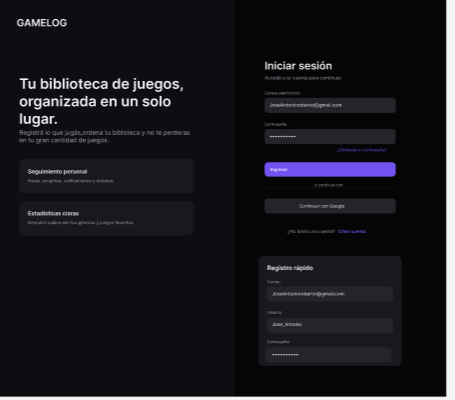
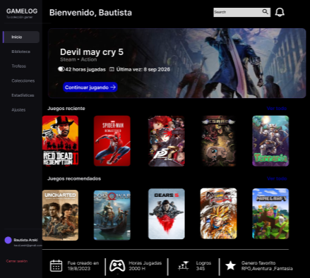
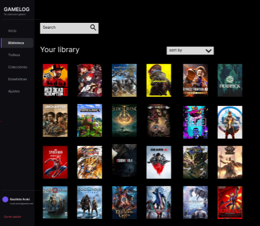
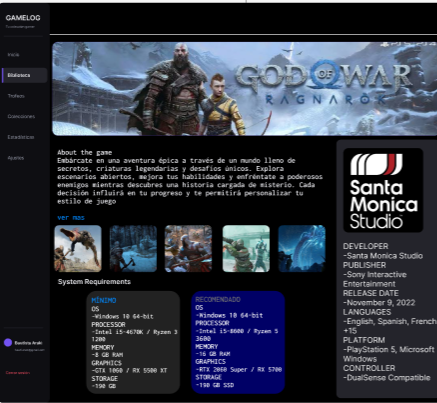

# 🎮 GameHub

GameHub es una aplicación web personal para organizar y gestionar una biblioteca de videojuegos.

El proyecto nace con el objetivo de aplicar y profundizar conocimientos de desarrollo de software, construyendo una aplicación completa desde el backend hasta la interfaz de usuario.

> 🚧 Proyecto actualmente en desarrollo.

## 📸 Preview

### Inicio de sesión y registro

Pantalla de autenticación con registro e inicio de sesión.



### Home

Vista principal con resumen de biblioteca, juegos destacados, métricas y acceso al catálogo.



### Biblioteca

Pantalla para gestionar la biblioteca personal de videojuegos.



### Búsqueda de videojuegos

Pantalla para buscar juegos en el catálogo local y, próximamente, mediante APIs externas como RAWG.

### Detalle de videojuego

Pantalla para visualizar información global del juego y datos personales del usuario, como estado, rating, horas jugadas y favorito.



## 🚀 Funcionalidades

- Registro e inicio de sesión de usuarios.
- Biblioteca personal de videojuegos.
- Visualización de juegos recientes.
- Catálogo global de videojuegos.
- Búsqueda y organización de juegos.
- Integración inicial con Steam.
- Integración inicial con RAWG para búsqueda externa de videojuegos.
- Seguimiento de horas jugadas.
- Estadísticas del usuario.
- Sistema de favoritos.
- Perfil personalizado.

Algunas funcionalidades todavía se encuentran en desarrollo.

## 🛠️ Tecnologías

### Backend

- Java
- Spring Boot
- Spring Data JPA
- REST API
- Jakarta Validation
- JUnit
- Mockito

### Base de datos

- MySQL
- MySQL Workbench

### Frontend

- React
- TypeScript
- Vite
- HTML
- CSS

### Herramientas

- Git
- GitHub
- Maven
- PowerShell

## 🏗️ Arquitectura

El backend está organizado siguiendo una arquitectura por capas:

```text
Controller → Service → Repository → MySQL
```

Para integraciones externas se mantiene una capa aislada:

```text
Controller → Service → Client / Integration → API externa
```

Ejemplos:

- Steam Web API
- RAWG Video Games Database API

La separación de responsabilidades busca mantener el código organizado, mantenible y preparado para incorporar nuevas funcionalidades.

## 📚 Objetivo del proyecto

GameHub es un proyecto personal que utilizo para llevar a la práctica conceptos de desarrollo de software aprendidos durante mi formación y continuar profundizando en Java, Spring Boot, bases de datos, APIs REST, testing, integración con servicios externos y desarrollo web.

También lo uso como proyecto de portfolio para demostrar evolución técnica, criterio de arquitectura y capacidad para construir una aplicación full stack de forma progresiva.

## 🔜 Próximos pasos

- Continuar desarrollando las funcionalidades de biblioteca y detalle de videojuego.
- Mejorar el sistema de autenticación.
- Incorporar autenticación con Spring Security y JWT.
- Permitir creación manual de videojuegos cuando no existan en el catálogo.
- Mejorar la integración con Steam.
- Completar la integración con RAWG para enriquecer datos e imágenes de videojuegos.
- Agregar más tests de servicios y controllers.
- Mejorar la experiencia de usuario y el diseño responsive.

## 👨‍💻 Autor

**Bautista Araki**

Estudiante de Licenciatura en Gestión de Tecnología de la Información – UADE.
